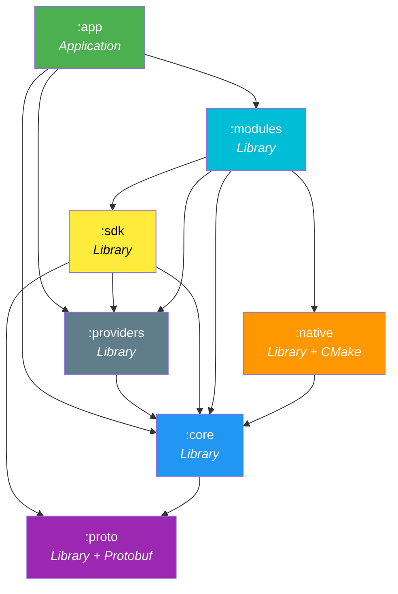
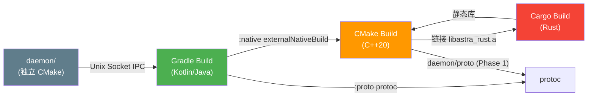
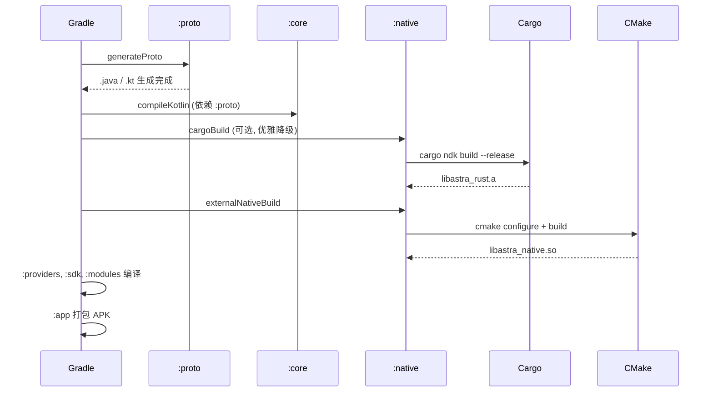

# AstraVeil — 系统架构

> 最后更新: 2026-08-02 | 版本: v2.2.0 Alpha | 协议: JSON IPC (Phase 0) → Protobuf (Phase 1)

---

## 目录

1. [系统概览](#1-系统概览)
2. [模块依赖图](#2-模块依赖图)
3. [模块职责](#3-模块职责)
4. [构建系统](#4-构建系统)
5. [安全架构](#5-安全架构)
6. [数据流](#6-数据流)
7. [版本与兼容性](#7-版本与兼容性)
8. [扩展指南](#8-扩展指南)
9. [补充文档索引](#9-补充文档索引)

---

## 1. 系统概览

AstraVeil 是 Android 系统级**能力操作层**（Capability Operating Layer）。
它不创建 root，而是**抽象 root 能力**：发现设备上的 root 后端，探测内核/SELinux
实际允许的操作，将结果暴露为**能力矩阵**供模块和 UI 读取。

```
┌─────────────────────────────────────────────────────────────────┐
│                        用户层 (UI)                               │
│  :app — Jetpack Compose, Material3, Liquid Glass, Navigation    │
│         终端 / 超级用户 / AstraHub / 设置 / 设备伪装              │
├─────────────────────────────────────────────────────────────────┤
│                        功能层                                    │
│  :modules — .avm 模块运行时 (安装/信任门/沙箱/兼容性)             │
│  :sdk     — 第三方模块开发者 SDK (AstraSdkFacade)                │
├─────────────────────────────────────────────────────────────────┤
│                        服务层                                    │
│  :providers — RootProvider 抽象 + Magisk/KernelSU/APatch 实现    │
│  :core      — 领域模型 / 策略引擎接口 / 事件总线 / IPC 协议       │
│  :proto     — Protobuf 协议定义 (Phase 1)                       │
├─────────────────────────────────────────────────────────────────┤
│                        原生层                                    │
│  :native — C++20 JNI 桥接 / procfs 探测 / su 扫描 / Rust 链接    │
│  rust/   — Rust 策略引擎 (Cargo, fail-closed weak symbol)       │
├─────────────────────────────────────────────────────────────────┤
│                        系统层                                    │
│  daemon/ — astrad (C++20 守护进程, Unix Socket IPC)              │
│  selinux/ — SELinux 策略                                        │
│  magisk-module/ — Magisk 部署包                                 │
└─────────────────────────────────────────────────────────────────┘
```

---

## 2. 模块依赖图

### 2.1 Gradle 模块依赖



### 2.2 依赖规则

| # | 规则 | 说明 |
|---|------|------|
| 1 | 单向依赖 | 上层可依赖下层，反之禁止 |
| 2 | `:core` 无项目依赖 | 最底层，仅依赖 `:proto` |
| 3 | `:native` 仅被 `:modules` 依赖 | JNI 复杂度不扩散 |
| 4 | `:sdk` 通过 `api()` 暴露 | 第三方开发者自动获得 `:core` + `:providers` + `:proto` |
| 5 | `:proto` 无项目依赖 | 仅依赖 protobuf runtime |
| 6 | 无循环依赖 | 已验证（见 `docs/MODULE_DEPENDENCY_GRAPH.md`） |

### 2.3 非 Gradle 组件



---

## 3. 模块职责

> 详细契约见 [`docs/MODULE_CONTRACTS.md`](docs/MODULE_CONTRACTS.md)

| 模块 | 命名空间 | 职责 | 关键类 |
|------|----------|------|--------|
| `:app` | `com.astraveil.app` | Compose UI、导航、终端、超级用户、AstraHub | `MainActivity`, ViewModels |
| `:core` | `com.astraveil.core` | 领域模型、策略引擎接口、事件总线、IPC 协议 | `CapabilityEngine`, `PermissionEngine`, `EventBus`, `SecurityManager` |
| `:providers` | `com.astraveil.providers` | Root 后端抽象 + 实现 | `RootProvider`, `ProviderRegistry`, `MagiskProvider` |
| `:sdk` | `com.astraveil.sdk` | 第三方模块 SDK | `AstraSdkFacade` |
| `:modules` | `com.astraveil.modules` | .avm 模块运行时 | `ModuleManager`, `TrustGate`, `ModuleRuntime` |
| `:native` | `com.astraveil.native` | JNI 桥接、procfs 探测、Rust 链接 | `NativeBridge` (Kotlin), `astra_native.cpp` |
| `:proto` | `com.astraveil.proto` | Protobuf 协议定义 | 生成类 |
| `rust/` | — | 策略引擎 (fail-closed) | `PolicyEngine`, `policy_check` (FFI) |
| `daemon/` | — | 系统守护进程 | `astrad`, `PolicyBridge`, `IpcServer` |

---

## 4. 构建系统

### 4.1 构建命令速查

| 目标 | 命令 |
|------|------|
| Android APK | `./gradlew :app:assembleDebug` |
| 全模块编译 | `./gradlew assembleDebug` |
| 单元测试 | `./gradlew testDebugUnitTest` |
| Proto 代码生成 | `./gradlew :proto:generateDebugProto` |
| Rust 引擎 | `./gradlew :native:cargoBuild` |
| Rust 检查 | `./gradlew :native:checkRustLibs` |
| Daemon | `cmake -S daemon -B daemon/build && cmake --build daemon/build` |
| Daemon (protobuf) | `cmake -S daemon -B daemon/build -DASTRA_USE_PROTOBUF=ON` |
| 全量清理 | `./gradlew clean && cd rust && cargo clean` |

### 4.2 工具链要求

| 工具 | 版本 | 用途 |
|------|------|------|
| JDK | 17 | Gradle / Kotlin |
| Android SDK | API 35 | 编译 |
| Android NDK | 27.2.12479018 | C++ JNI |
| CMake | 3.22.1 | Native 构建 |
| Rust | stable (1.75+) | 策略引擎 |
| cargo-ndk | latest | Rust → Android |
| protoc | 4.29+ | Proto 代码生成 (daemon, Phase 1) |

### 4.3 构建顺序



---

## 5. 安全架构

### 5.1 信任边界

```
┌─────────────────────────────────────────────────────────────┐
│  TRUSTED ZONE (系统级)                                       │
│  ┌─────────┐  ┌──────────┐  ┌───────────────────────────┐  │
│  │ astrad  │  │ SELinux  │  │ Kernel (seccomp/cgroups)  │  │
│  └────┬────┘  └──────────┘  └───────────────────────────┘  │
│       │ Unix Socket (SO_PEERCRED UID 白名单)                │
├───────┼─────────────────────────────────────────────────────┤
│  MANAGED ZONE (AstraVeil 管控)                               │
│  ┌────┴────┐  ┌──────────┐  ┌──────────┐  ┌────────────┐  │
│  │ :native │  │ :modules │  │ :core    │  │ :providers │  │
│  └─────────┘  └──────────┘  └──────────┘  └────────────┘  │
├─────────────────────────────────────────────────────────────┤
│  UNTRUSTED ZONE (第三方应用 / 模块)                           │
│  ┌─────────────────────────────────────────────────────┐   │
│  │ .avm 模块 (通过 TrustGate + 沙箱运行)                │   │
│  └─────────────────────────────────────────────────────┘   │
└─────────────────────────────────────────────────────────────┘
```

### 5.2 策略执行链（Fail-Closed）

```
请求 → :sdk API → :core PolicyEngine → :modules 路由
  → daemon IPC → PolicyBridge → Rust Engine (policy_check)
  → Allow / Deny / RequireApproval
  → 异步: 审计日志 (JSONL, append-only)

⚠️ Rust 未链接时 → weak symbol fallback → DENY (fail-closed)
```

### 5.3 关键安全机制

| 机制 | 说明 |
|------|------|
| Fail-closed | Rust 引擎缺失时所有特权操作被拒绝 |
| TrustGate | 模块安装需 Ed25519 签名验证 (`strict=true`) |
| TOCTOU 防护 | 单 staging 文件 + 安装前 hash 重验证 |
| Zip Slip 防护 | 规范路径验证 + zip bomb 限制 |
| SO_PEERCRED | IPC 连接 UID 白名单验证 |
| 审计链 | 所有特权命令记录到 append-only JSONL |

> 完整威胁模型见 [`docs/THREAT_MODEL.md`](docs/THREAT_MODEL.md)

---

## 6. 数据流

> 详细时序图见 [`docs/DATA_FLOW.md`](docs/DATA_FLOW.md)

### 6.1 策略评估

```
用户操作 → :app → :sdk → :core → :modules → daemon IPC
  → PolicyBridge → Rust (policy_check) → 决策返回 → UI 更新
```

### 6.2 模块安装

```
AstraHub 下载 → SHA-256 验证 → TrustGate (Ed25519)
  → 解包 (Zip Slip 防护) → ModuleRegistry 注册
  → :native (System.load) → daemon (沙箱创建) → ACTIVE
```

### 6.3 IPC 帧格式（当前 Phase 0: JSON）

```
Unix Domain Socket: /dev/astra/astrad.sock

┌──────────────────────────────────────────────┐
│ Frame Header                                  │
│ ┌──────────────────────────────────────────┐ │
│ │ uint32 payload_length (big-endian)       │ │
│ │ uint8  message_type                      │ │
│ └──────────────────────────────────────────┘ │
├──────────────────────────────────────────────┤
│ Payload (JSON, nlohmann)                      │
│ { "type": "...", "moduleId": "...", ... }    │
└──────────────────────────────────────────────┘

Phase 1 迁移目标: Protobuf (IpcEnvelope)
```

---

## 7. 版本与兼容性

### 7.1 模块 API 版本

| apiVersion | 状态 | 说明 |
|------------|------|------|
| 1 | 遗留 | 初始模块 API |
| 2 | 遗留 | 添加能力声明 |
| 3 | 当前 | 结构化 IPC + TrustGate |

### 7.2 IPC 协议

| 阶段 | 格式 | 状态 |
|------|------|------|
| Phase 0 | JSON (nlohmann) | ✅ 当前 |
| Phase 1 | Protobuf (IpcEnvelope) | ⏳ `:proto` 模块已就绪，daemon 集成待完成 |

### 7.3 兼容性规则

- 新增字段：旧端忽略未知字段
- 删除字段：禁止（`reserved`）
- 语义变更：新建版本包
- 模块兼容性：`minAstraVeilVersion` + `requiredCapabilities` 检查

---

## 8. 扩展指南

### 8.1 添加新模块

1. 在 `:modules` 中创建包 `com.astraveil.modules.<name>`
2. 实现 `AstraModule` 接口
3. 在 `ModuleRegistry` 中注册
4. 定义 `ModuleManifest`
5. 添加单元测试

### 8.2 添加新 Root 后端

1. 在 `:providers` 中实现 `RootProvider` 接口
2. 在 `ProviderRegistry` 中注册
3. 添加探测逻辑（文件存在 + 功能性验证）
4. 更新能力矩阵

### 8.3 添加新 JNI 函数

1. 在 `NativeBridge.kt` 声明 `external fun`
2. 在 `astra_native.cpp` 实现 `Java_com_astraveil_nativelib_NativeBridge_...`
3. 更新 `CMakeLists.txt` 源文件列表（如新增 .cpp）

### 8.4 添加新 IPC 消息类型

1. Phase 0: 在 `json_codec.cpp` 中添加 type byte + 处理
2. Phase 1: 在 `ipc.proto` 的 `IpcEnvelope.payload` oneof 中添加字段

---

## 9. 补充文档索引

| 文档 | 内容 |
|------|------|
| [`docs/MODULE_DEPENDENCY_GRAPH.md`](docs/MODULE_DEPENDENCY_GRAPH.md) | Gradle 模块 DAG、依赖方向规则、循环依赖检查 |
| [`docs/MODULE_CONTRACTS.md`](docs/MODULE_CONTRACTS.md) | 模块间 API 契约、禁止事项、违规检测脚本 |
| [`docs/DATA_FLOW.md`](docs/DATA_FLOW.md) | 数据流时序图、IPC 协议、错误处理 |
| [`docs/ASTRAHUB_SCHEMA.md`](docs/ASTRAHUB_SCHEMA.md) | AstraHub 索引 Schema、能力词汇表、信任级别 |
| [`docs/ASTRAHUB_SUBMISSION.md`](docs/ASTRAHUB_SUBMISSION.md) | 模块提交指南 |
| [`docs/MODULE_DEVELOPER_GUIDE.md`](docs/MODULE_DEVELOPER_GUIDE.md) | .avm 格式、签名、沙箱、SDK |
| [`docs/THREAT_MODEL.md`](docs/THREAT_MODEL.md) | STRIDE 分析、攻击树、残余风险 |
| [`docs/SECURITY.md`](docs/SECURITY.md) | 漏洞报告策略 |
| [`docs/ROADMAP.md`](docs/ROADMAP.md) | 路线图 |
| [`native/RUST_BUILD.md`](native/RUST_BUILD.md) | Rust 构建集成、降级策略、故障排除 |
| [`proto/README.md`](proto/README.md) | Protobuf 协议定义、版本策略 |

---

## 附录：文件树

```
AstraVeil/
├── app/                          :app — Compose UI
├── core/                         :core — 领域模型
├── providers/                    :providers — Root 后端
├── sdk/                          :sdk — 第三方 SDK
├── modules/                      :modules — .avm 运行时
├── native/                       :native — JNI + C++
│   ├── CMakeLists.txt            Rust 发现 + 降级
│   ├── build.gradle.kts          cargoBuild task
│   └── src/main/cpp/
│       ├── astra_native.cpp      JNI 桥接 (6 函数)
│       ├── capability_probe.cpp  内核/overlayfs/ns 探测
│       └── su_scanner.cpp        su 路径扫描
├── proto/                        :proto — Protobuf 定义
│   └── src/main/proto/astra/
│       ├── common/v1/types.proto
│       ├── ipc/v1/ipc.proto
│       ├── policy/v1/policy.proto
│       └── module/v1/module.proto
├── rust/                         Rust 策略引擎 (Cargo)
│   └── build-android.sh          多 ABI 构建脚本
├── daemon/                       astrad 守护进程 (C++20)
│   ├── CMakeLists.txt
│   └── proto/CMakeLists.txt      Protobuf C++ 集成 (Phase 1)
├── selinux/                      SELinux 策略
├── magisk-module/                Magisk 部署包
├── astrahub/                     模块仓库索引
│   ├── schema/                   JSON Schema (3 文件)
│   └── modules/index.json
├── docs/                         文档 (9 文件)
├── tools/                        CLI 工具
├── scripts/                      构建/CI 脚本
├── gradle/libs.versions.toml     Version Catalog
├── settings.gradle.kts           模块注册 (7 模块)
├── ARCHITECTURE.md               ← 本文件
└── README.md
```
